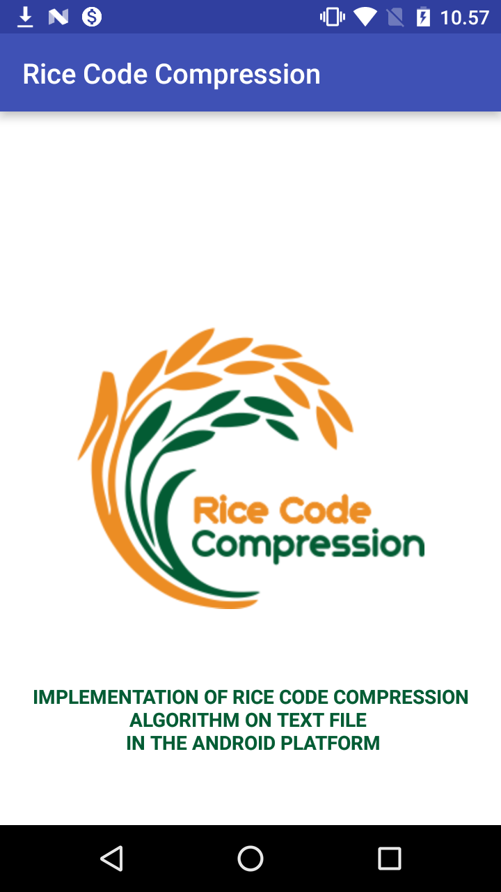
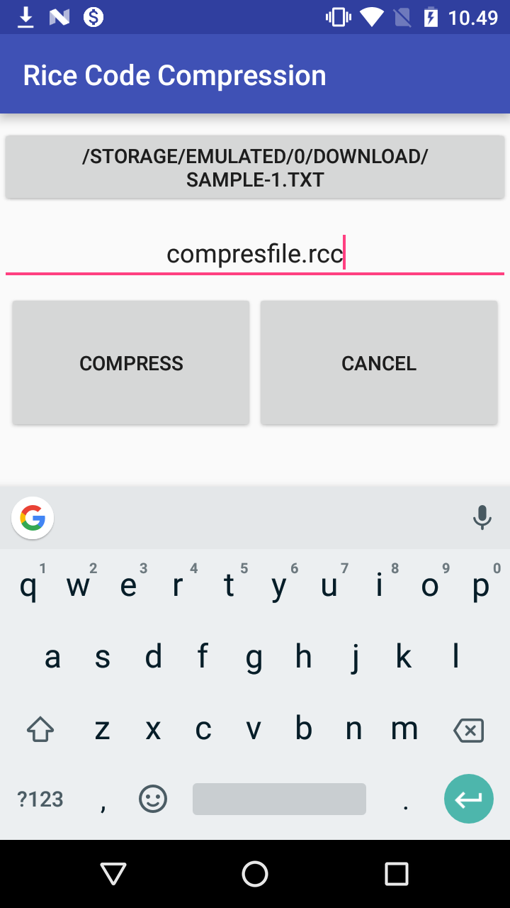
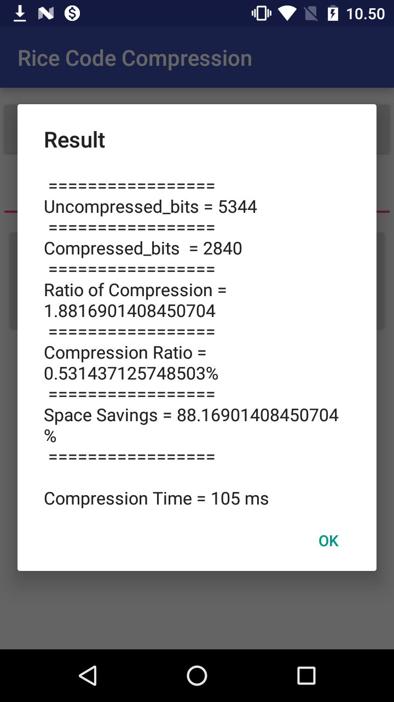

# Rice Compression Algorithm Implementation on Android Apps
Rice Compression Algorithm Implementation Code In Text Files On  Java and Android Platform.

Rice Code algorithm is an algorithm created by Robert F. Rice, which shows the use of a subset of Golomb Coding derivatives to generate a simple code that allows suboptimal of the prefix code itself. The Rice Code algorithm is used in an adaptive coding scheme, which can refer only to a subset of Golomb Coding derivatives.

In this Project I want to implement Rice Code Algorithm to compress text file on an android app.

# SCREENSHOT / DEMO

  
  
  

## This Application Feature

1. Compressed file type is a text file with extension .TXT.

1. The parameters to be used to measure performance are Ratio of Compression (RC), Compression Ratio (CR), Redudancy (RD), Space Savings (SS), and time required during compression and decompression process.

1. The text code to be used in this study is an 8 bit ASCII (American Standard Code for Information Interchange) code.

#### Made with &#9829;
Follow me on instagram :)
- [@iqbalhood](https://instagram.com/iqbalhood)

### Contribution Process

1. Submit an issue describing your proposed change to the repo in question.
1. The repo owner will respond to your issue promptly.
1. Fork the desired repo, develop and test your code changes.
1. Ensure that your code adheres to the existing style of the library to which
   you are contributing.
1. Ensure that your code has an appropriate set of unit tests which all pass.
1. Submit a pull request and cc @iqbal09
